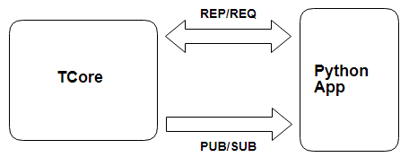

# README


Client App行情需建立两条ZeroMQ联机，一条REP/REQ联机，一条PUB/SUB联机。若要连接交易，需再建立另两条REP/REQ、PUB/SUB联机。

**注意事项：**

1.分页查询需要带入QryIndex\(带空则回第一页\)，每页50笔数据，拿最后一笔QryIndex信息可以往下查，最后一页则回空数据。

2.一分钟内需要向service发送PING或者有发送请求讯息，超过一分钟service没收到响应则会清掉该联机session。

